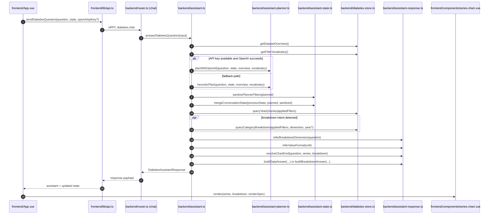

# assistant README

This document explains what the assistant module does.

## What it is

The assistant module is the orchestration layer for question answering.
It translates a user question into safe diabetes filters, executes data queries,
and returns both a natural-language answer and chart instructions.

## Responsibilities at a glance

1. Accept request context

- Input includes question, optional prior conversation state, and optional OpenAI key override.

2. Gather dataset guardrails

- Loads dataset overview and allowed filter vocabulary before planning.
- This constrains planning to known values and reduces invalid filter proposals.

3. Plan intent (model-first, deterministic fallback)

- Attempts OpenAI planning first.
- Falls back to local heuristics when model planning is unavailable or fails.

4. Enforce runtime safety on planned filters

- Treats planner output as untrusted runtime data.
- Normalizes invalid shapes/types and drops empty values before querying.

5. Merge and persist conversation state

- Applies sanitized filter changes over prior state.
- Updates turn metadata (last question/answer/render and turn count).

6. Query and shape result data

- Always queries yearly trend data.
- Optionally queries breakdown data for comparison questions (age, sex, race, education, state, indicator).

7. Compute render policy and answer text

- Resolves chart kind (line/bar/pie), value format, labels, and subtitle.
- Builds a concise answer for trend, breakdown, or no-data scenarios.

8. Return one structured payload

- answer, state, render, series, breakdown, appliedFilters.

## In short

This module coordinates planning, safety checks, data queries, and render policy.
The data access logic itself remains in `diabetes-store`; the assistant composes those pieces into one response.

## Architecture intent

The four explicit layers:

1. LLM planning boundary

- File: `backend/src/assistant-planner.ts`
- Purpose: translate question + prior state into a planner result (`answer`, `filters`, `render`).
- Contains both:
  - OpenAI adapter (`planWithOpenAI`) for model-based planning.
  - Local deterministic fallback (`heuristicPlan`) when no key is present or model calls fail.

2. State safety boundary

- File: `backend/src/assistant-state.ts`
- Purpose: treat planner output as untrusted runtime input.
- Responsibilities:
  - sanitize filter shapes/types (`sanitizePlannerFilters`)
  - merge prior + new state (`mergeConversationState`)

3. Response/render policy boundary

- File: `backend/src/assistant-response.ts`
- Purpose: decide how to explain and visualize query results.
- Responsibilities:
  - infer breakdown dimension
  - infer value format
  - choose chart kind
  - build human-readable trend/breakdown summaries

4. Orchestration boundary

- File: `backend/src/assistant.ts`
- Purpose: workflow glue only.
- Responsibilities:
  - load overview + vocabulary
  - select planner path
  - sanitize + merge state
  - run store queries
  - assemble the final response payload

### Request lifecycle

1. Frontend sends `question`, optional `state`, optional `openAiApiKey`.
2. `assistant.ts` loads dataset context from `diabetes-store`.
3. Planner module returns a proposed plan (OpenAI or heuristic).
4. State module sanitizes planner filters and merges conversation state.
5. Store queries run with applied filters (yearly series, optional breakdown).
6. Response module computes answer text + chart policy.
7. `assistant.ts` returns one structured payload: `answer`, `state`, `render`, `series`, `breakdown`, `appliedFilters`.

### Sequence diagram

### Why this split matters

- LLM boundary is explicit and replaceable.
- Data access stays in first-party code (`diabetes-store`), not in model output.
- Render logic is deterministic and reviewable.
- Conversation state transitions are centralized and testable.
